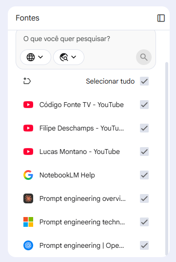
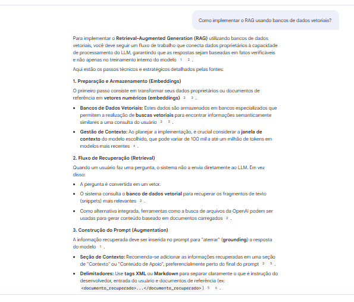
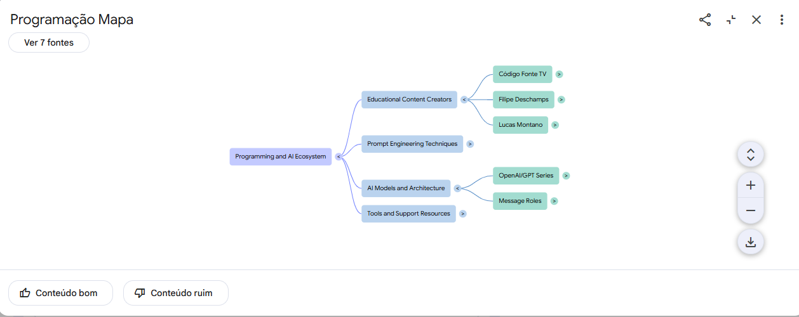

# 🤖 Especialista em IA com NotebookLM

> Caderno de estudos desenvolvido como parte do desafio da DIO utilizando o **Google NotebookLM** para explorar como construir um **Assistente Especialista com Inteligência Artificial** por meio de LLMs, Prompt Engineering, Context Engineering e RAG (Retrieval-Augmented Generation).

---

## 📌 Sobre o Projeto

O objetivo deste projeto foi utilizar o **NotebookLM** como ferramenta de aprendizagem ativa para estudar a construção de Assistentes Especialistas em IA.

Durante o processo, foram selecionadas fontes oficiais e conteúdos especializados, que serviram como base para explorar conceitos fundamentais, realizar testes de prompts, consolidar o conhecimento e produzir um miniguia de estudos.

Além de compreender a teoria, o projeto buscou desenvolver habilidades de pesquisa, organização do conhecimento e engenharia de prompts, competências cada vez mais valorizadas no mercado de Inteligência Artificial.

---

# 🎯 Objetivos

- Compreender o funcionamento dos Large Language Models (LLMs);
- Aprender boas práticas de Prompt Engineering;
- Entender o papel do Context Engineering;
- Estudar como funciona uma arquitetura RAG;
- Conhecer os componentes necessários para construir um Assistente Especialista;
- Criar um conjunto de prompts reutilizáveis para futuros estudos.

---

# 📚 Fontes Utilizadas

As seguintes fontes foram adicionadas ao NotebookLM:

## 📄 Documentações Oficiais

- OpenAI — Prompt Engineering Guide
- Anthropic — Prompt Engineering Documentation
- Microsoft Learn — Prompt Engineering
- Google NotebookLM Help
- LangChain — RAG Concepts

## 🎥 Vídeos

- Filipe Deschamps
- Código Fonte TV
- Lucas Montano

---

# 🤖 Como o NotebookLM foi utilizado

O NotebookLM foi utilizado como um ambiente de estudo para:

- organizar as fontes utilizadas;
- realizar perguntas sobre os documentos;
- comparar conceitos;
- gerar resumos;
- construir um glossário;
- criar mapas mentais;
- produzir um guia de estudos;
- validar o entendimento dos conceitos por meio de testes e perguntas.

---

# 🧠 Engenharia de Prompts

Durante o estudo foram realizados diversos testes para compreender como melhorar a qualidade das respostas geradas pela IA.

## Prompt 1

> Explique como construir um Assistente Especialista do zero.

**Objetivo**

Compreender os componentes fundamentais de uma arquitetura baseada em IA.

---

## Prompt 2

> Qual a diferença entre Prompt Engineering, Context Engineering e RAG?

**Objetivo**

Entender o papel de cada técnica dentro de um sistema de IA.

---

## Prompt 3

> Quais componentes não podem faltar em um Assistente Especialista?

**Objetivo**

Identificar os elementos essenciais para construir soluções robustas.

---

## Prompt 4

> Monte uma arquitetura completa para um Assistente Especialista.

**Objetivo**

Visualizar como os diferentes componentes se conectam em uma aplicação real.

---

## Prompt 5

> Quais erros são mais comuns ao desenvolver um Assistente Especialista?

**Objetivo**

Conhecer boas práticas e evitar problemas comuns.

---

## Prompt 6

> Faça um resumo completo utilizando todas as fontes.

**Objetivo**

Consolidar o aprendizado obtido durante o estudo.

---

# 📖 Miniguia de Estudos

## O que é um LLM?

Um Large Language Model (LLM) é um modelo treinado com grandes volumes de texto para compreender e gerar linguagem natural.

---

## O que é Prompt Engineering?

É a prática de elaborar instruções claras e estruturadas para orientar o comportamento de um modelo de IA.

Boas práticas:

- definir objetivo;
- fornecer contexto;
- especificar formato da resposta;
- utilizar exemplos;
- limitar o escopo da tarefa.

---

## O que é Context Engineering?

É o processo de organizar todas as informações que serão disponibilizadas para a IA durante a geração da resposta.

Inclui:

- documentos;
- histórico;
- memória;
- regras;
- exemplos;
- instruções.

---

## O que é RAG?

Retrieval-Augmented Generation (RAG) combina recuperação de informações com geração de texto.

Fluxo simplificado:

Usuário → Busca nas fontes → Recuperação → Contexto → Resposta

Essa abordagem reduz alucinações e melhora a precisão das respostas.

---

## Como construir um Assistente Especialista

Etapas principais:

1. Definir o domínio de conhecimento;
2. Selecionar fontes confiáveis;
3. Organizar a base de conhecimento;
4. Criar bons prompts;
5. Testar diferentes cenários;
6. Refinar continuamente as respostas.

---

# 📚 Glossário

| Conceito | Descrição |
|----------|-----------|
| LLM | Large Language Model |
| Prompt | Instrução enviada para a IA |
| Prompt Engineering | Criação de prompts eficientes |
| Context Engineering | Organização do contexto fornecido à IA |
| RAG | Recuperação de informações antes da geração da resposta |
| Embedding | Representação vetorial de textos |
| Token | Unidade utilizada pelo modelo para processar texto |
| Hallucination | Resposta incorreta gerada pela IA |
| Base de Conhecimento | Conjunto de documentos utilizados pela IA |
| Vector Database | Banco utilizado para armazenar embeddings |

---

# 🚀 Prompts Reutilizáveis

## Professor

Explique este assunto como se eu nunca tivesse estudado IA.

---

## Especialista

Explique utilizando exemplos práticos e referências das fontes.

---

## Mentor

Monte um plano de estudos para dominar este tema.

---

## Revisor

Analise este conteúdo procurando erros conceituais.

---

## Resumidor

Resuma todas as fontes em uma única página.

---

## Quiz

Crie um teste com perguntas sobre os principais conceitos.

---

# 💡 Principais Aprendizados

Durante este projeto foi possível compreender que:

- a qualidade das respostas depende diretamente da qualidade dos prompts;
- fornecer contexto adequado melhora significativamente o desempenho da IA;
- utilizar fontes oficiais reduz a ocorrência de respostas incorretas;
- o NotebookLM facilita a organização e consolidação do conhecimento;
- construir um Assistente Especialista envolve mais do que escrever bons prompts: é necessário estruturar corretamente a base de conhecimento e o contexto disponível para o modelo.

---

# 🛠 Tecnologias Utilizadas

- Google NotebookLM
- Inteligência Artificial Generativa
- Large Language Models (LLMs)
- Prompt Engineering
- Context Engineering
- RAG
- GitHub
- Markdown

---

# 📸 Evidências

Durante o desenvolvimento foram gerados:

## 📸 Fontes adicionadas

## 💬 Conversa com o NotebookLM

## 🧠 Mapa Mental

> As imagens desses recursos podem ser encontradas na pasta **/imagens** deste repositório.

---

# 👩‍💻 Autora

**Ana Carolina Moreira de Siqueira**

Projeto desenvolvido como parte do desafio da **Digital Innovation One (DIO)** com o objetivo de explorar o uso do NotebookLM como ferramenta de aprendizagem ativa e documentação técnica sobre Inteligência Artificial.
